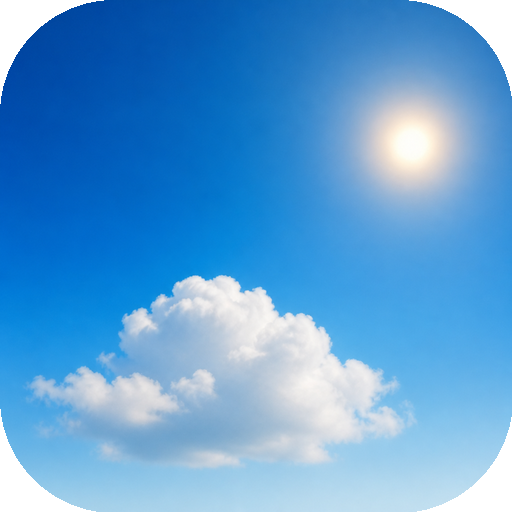
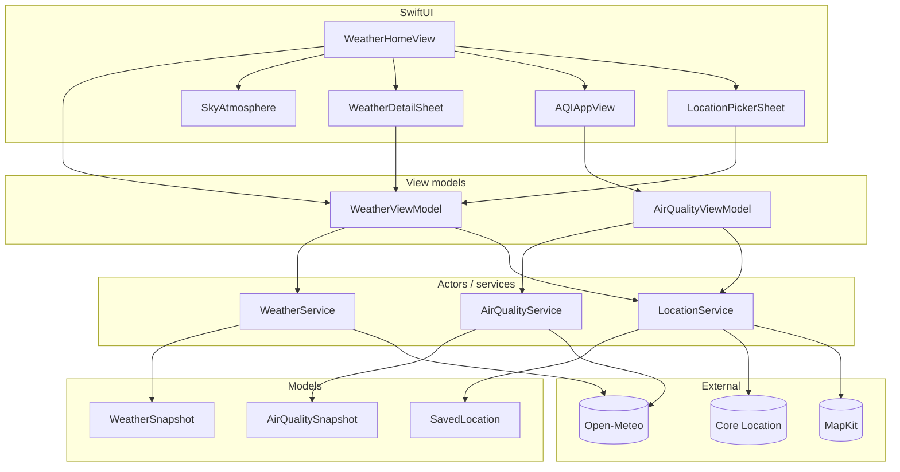
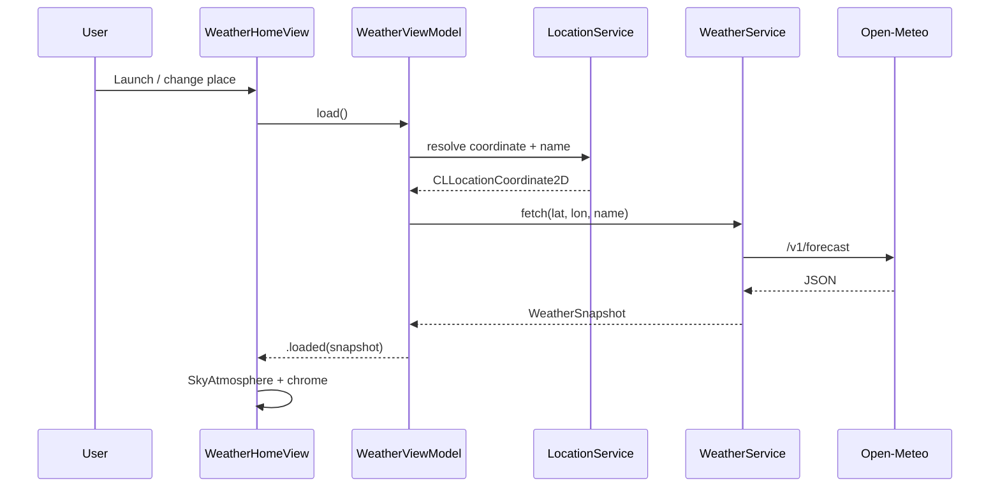

<p align="center">
  
</p>

# Weather

A minimal iOS weather app built with SwiftUI and Liquid Glass. One glance feels like looking outside — photo skies, sparse chrome, and air quality explained in plain language.

**Requirements:** Xcode 26 · iOS 26+ · [XcodeGen](https://github.com/yonaskolb/XcodeGen)

| Screen | What it does |
| --- | --- |
| **Home** | Condition sky, large temperature, °C / °F toggle |
| **Air Quality** | US AQI number, category, scale, and what to do |
| **Feels like** | Today H/L, sunrise / sunset, hourly + 7-day |
| **Locations** | Search places, save several, jump between them |

---

## Features

- Photographic sky by condition and day / night
- Liquid Glass controls (location pill, units, actions)
- Multi-location picker with MapKit search + persistence
- Full-screen AQI experience — US EPA categories, no PM jargon
- Open-Meteo forecast + air-quality APIs (no API key)

---

## Architecture



### Data flow



---

## Project layout

```
Weather/
├── project.yml                 # XcodeGen
├── Weather.xcodeproj           # generated / checked in
├── docs/previews/              # README screenshots
└── Weather/
    ├── WeatherApp.swift
    ├── Views/                  # Home, AQI, details, locations, sky
    ├── ViewModels/
    ├── Models/
    ├── Services/               # Weather, AQI, Location
    ├── Theme/                  # Glass helpers
    └── Assets.xcassets         # Sky plates + accent
```

---

## Run

```bash
# From this directory
brew install xcodegen   # if needed
xcodegen generate
open Weather.xcodeproj
```

Select an iOS 26 simulator or device, then Run.

**Location:** the app requests *When In Use* location. On Simulator, set Features → Location → Custom Location if needed.

---

## APIs

| Source | Endpoint | Purpose |
| --- | --- | --- |
| [Open-Meteo Forecast](https://open-meteo.com/) | `/v1/forecast` | Current, hourly, 7-day, sunrise / sunset |
| [Open-Meteo Air Quality](https://open-meteo.com/en/docs/air-quality-api) | `/v1/air-quality` | US AQI |

No keys or `.env` files. Nothing secret is required to build or run.

---

## AQI copy

The AQI screen shows the **US Air Quality Index** (0–500) and EPA-style categories. Copy is written for people, not scientists — meaning + what to do — instead of raw PM / O₃ / NO₂ chips.

---

## License

Portfolio project — use and adapt freely with attribution appreciated.
